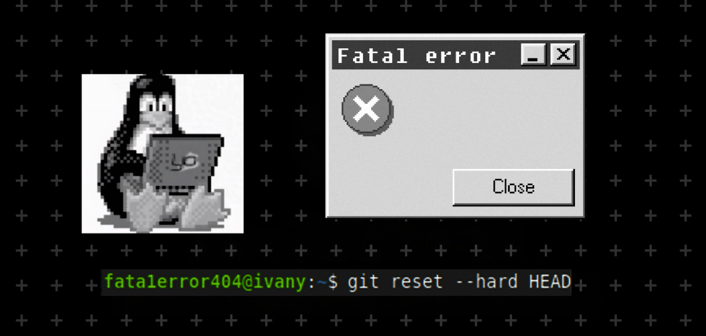
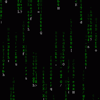

<!-- markdownlint-disable MD033 MD041 MD045 MD047 -->



<h2>  Hi, welcome! </h2>

<table>
  <tr>
    <td>
      <div>
        I am a Computer Vision researcher and full-stack web developer from <strong>Moscow, Russia</strong>
        
        , currently studying at Tsinghua University in <strong>Beijing, China</strong>
        .
      </div>
      </br>
      <pre>
┌──┤ MAIN ├─────────▰▰▰
│
├─■ Graduate CS student
├─■ Interested in: Computer Vision,
│   Computer Graphics, Deep Learning
├─■ I am mostly available at <a href="https://t.me/yazykovii">Telegram</a>
│
└───────────────────────────────▰▰▰
      </pre>
    </td>
    <td>
      
    </td>
  </tr>
</table>

```c++
──┤ A LITTLE MORE ABOUT ME.. ├─────────▰▰▰

#include <iostream>
using namespace std;

class Fata1error404
{
public:
    string pronouns = "he | him";
    string bachelor = "Moscow Institute of Physics and Technology";
    string master = "Tsinghua University";
    string role = "Computer Vision Researcher";
    string languagesSpoken[3] = {"ru_RU", "en_US", "zh_CN"};

    void sayHi() const
    {
        cout << "Thanks for dropping by, hope you find some of my work interesting." << endl;
    }
};

int main()
{
    Fata1error404 me;
    me.sayHi();
}
```

<table>
  <tr>
    <td>
      <div>
        Working at the <a href="https://cg.cs.tsinghua.edu.cn/">Graphics & Geometric Computing Group</a> at Tsinghua University on <strong>physics-based 3D reconstruction.</strong>
      </div>
      <br>
      <pre>
   ___   _      _______               ~  ~  ~
  [(_)] |=|    | [◉¯]  |  ~~~~~   ~  ~/ \__
   '-`  |_|    |_______|           __/     \___
  /mmm/  /         |/                           \__
        |__________|
      </pre>
    </td>
    <td>
      
    </td>
  </tr>
</table>

<h3>  Open-source projects </h3>

<table>
  <thead>
    <tr>
      <th>Project</th>
      <th>Description</th>
    </tr>
  </thead>
  <tbody>
    <tr>
      <td>
        <a href="https://github.com/fata1error404/tsinghua-web-information-retrieval">EmojiNotion 🔍</a>
      </td>
      <td>
        A web-based text editor with semantic emoji search and prediction engine, natively supporting an unlimited number of custom and animated emojis, crawled and captioned automatically via a multimodal retrieval pipeline, and rendered as normal inline text characters.
      </td>
    </tr>
    <tr>
      <td>
        <a href="https://github.com/fata1error404/tsinghua-computer-graphics">Terrain Engine ⛰️</a>
      </td>
      <td>
        A terrain engine for real-time 3D rendering of terrain, skybox, water, and advanced effects like lighting, shadows, weather, and dynamic waves, with support for free camera movement.
      </td>
    </tr>
    <tr>
      <td width="250">
        <a href="https://github.com/yourusername/distributed-data-center">
          Distributed Data Center 💾
        </a>
      </td>
      <td>
        A distributed data center system managing both structured (relational tables) and unstructured (text, images, videos) data.
      </td>
    </tr>
    <tr>
      <td width="250">
        <a href="https://github.com/fata1error404/ride-sharing-service">
          Taxi ride sharing service 🚖
        </a>
      </td>
      <td>
        A representation of a real taxi ride sharing service concept built on microservices architecture.
      </td>
    </tr>
  </tbody>
</table>

</br>


<picture>
  <source media="(prefers-color-scheme: dark)" srcset="https://raw.githubusercontent.com/fata1error404/fata1error404/output/github-snake-dark.svg">
  <source media="(prefers-color-scheme: light)" srcset="https://raw.githubusercontent.com/fata1error404/fata1error404/output/github-snake.svg">
  
</picture>